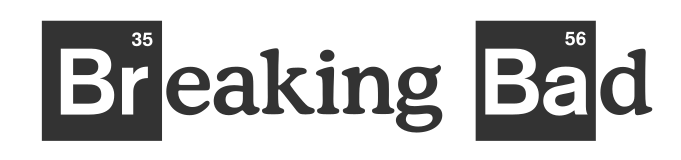

<h1 align="center">
    
    <br>
</h1>

<h4 align="center">
  App built with ReactJS to list characters from Breaking Bad series.
</h4>

<p align="center">
  <a href="#space_invader-technologies">Technologies</a>&nbsp;&nbsp;&nbsp;|&nbsp;&nbsp;&nbsp;
  <a href="#pager-running">Running</a>&nbsp;&nbsp;&nbsp;|&nbsp;&nbsp;&nbsp;
  <a href="#memo-license">License</a>
</p>

## :space_invader: Technologies

This project was developed with the following technologies:

- [ReactJS](https://reactjs.org/)
- [Styled Components](https://styled-components.com/)
- [Axios](https://github.com/axios/axios)
- [React Icons](https://react-icons.netlify.com/)

## :pager: Running

```sh
#install dependencies
yarn

#start application at http://localhost:3000
yarn start
```

### :memo: License

This project is licensed under the MIT License - see the [LICENSE](LICENSE) file for details
